# Welcome to Games-World project

This project is an example of a quiz created in  HTML, CSS and JavaScript

See this project on live enviroment on GitHub Pages here: <https://lseparatio.github.io/Games-World/>

## Features

Click To Expand Features

### Navigation

- Same navigation menu is used across all pages for consistency.

- Navigation was designed to be easy to use and to understand.

- Navigation was designed to work well on all devices.
- Even if a nav-bar was not necessary for this project, I created one to make it easier to expand the project with other pages, games, etc ...

### First Screen

First Screen was designed to present the website for user in a friendly manner and to ask for user name.

- First Screen Desktop

- First Screen Mobile

### Name validation screens

- Empty name validation screen

- Special characters validation screen

### Choose topic screen

Choose topic screen is designed to allow the user to choose an topic of the quiz. Page is fully responsive.

- Choose topic screen desktop

- Choose topic screen tablet

- Choose topic screen mobile

### Questions screen

This screen is designed to rondom show questions and to alow user to select an answer only by disabling the button after any button is clicked.

- Questions screen desktop

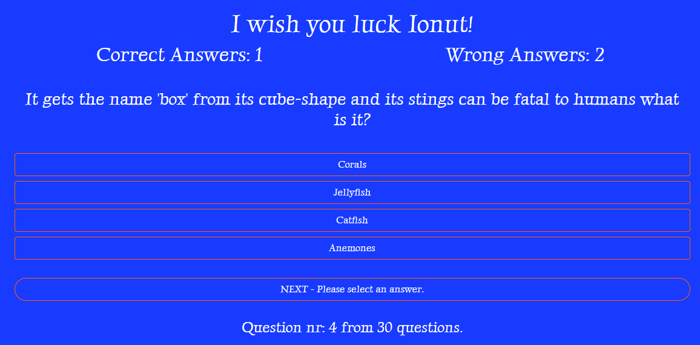

- Questions screen mobile

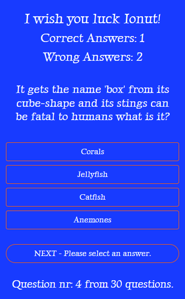

### Answered question screen

When user is selecting an answer buttons are getting disabled to don't allow user to change the answer. Buttons are changing the colors in red and green to provide feedback if user was right.

- Answered question screen desktop

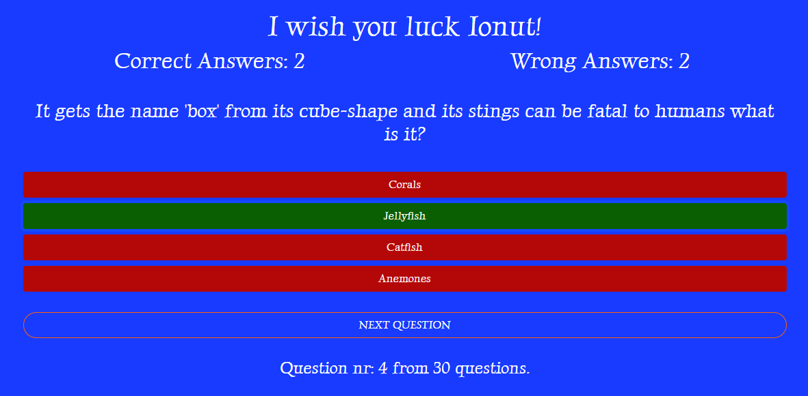

- Answered question screen mobile 

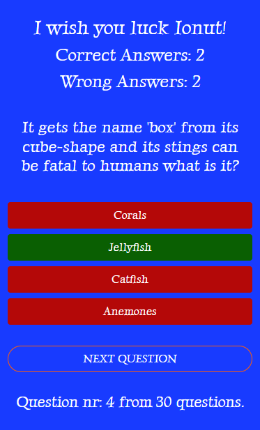

### Feedback screen

Last screen is designed to provide feedback to user. Will be shown a different message if the correct answers are more that wrong ones, if answers are equal and if the wrong ones are more that correct ones. And total correct and wrong are displayed. Next user have option to select another topic or to go to the front page.

- Feedback screen desktop

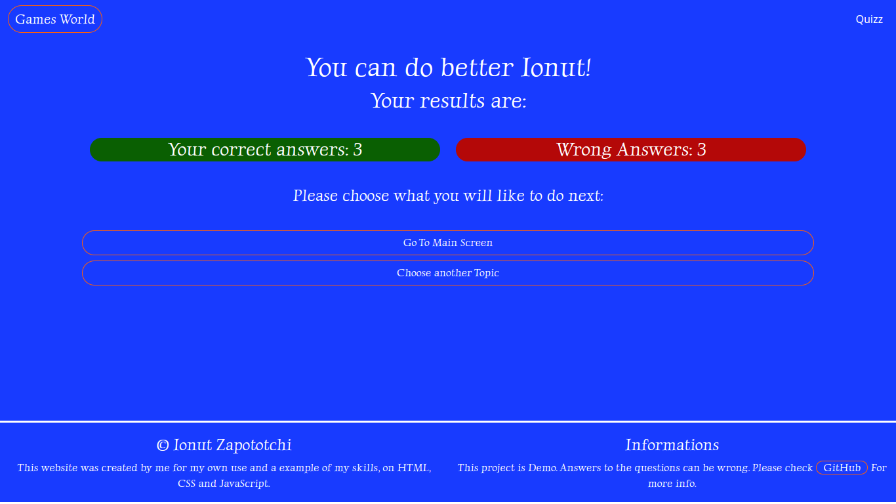

- Feedback screen mobile 

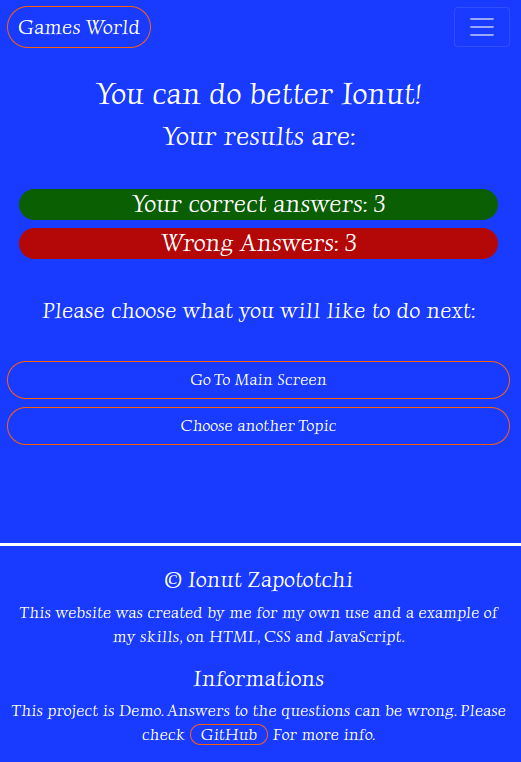

## The Creation Timeline

Click to open creation timeline

### User Stories

As a site owner:

- I want users to understand that this is a quiz page.
- I want users to be able to easily navigate my website on any device.
- I want to be able to collect user name.
- I want to serve questions and feedback in a easy to understand way.

As a user:

- I want to be able to view the website on any device.
- I want the menu to be intuitive.
- I want to learn what questions i answered right and what not.
- I want to be able to see  my total score at the end.

### Wireframes, i used Balsamiq

Click to expend wireframes

- Mobile Wireframes:

 1. Index Page

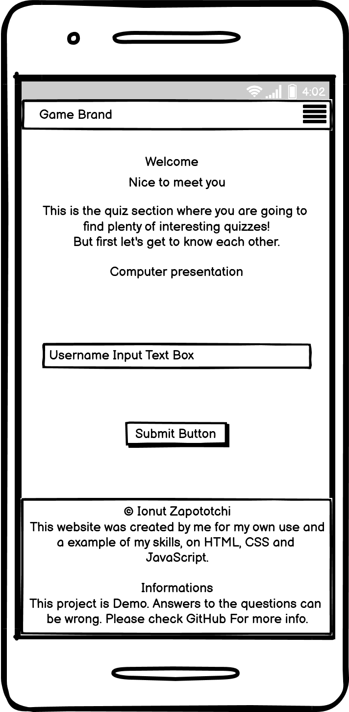

 2. Choose topic screen

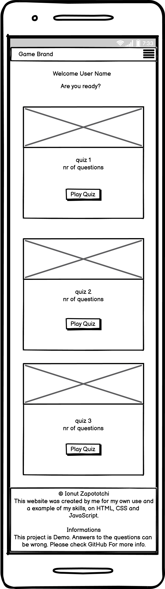

 3. Question screen

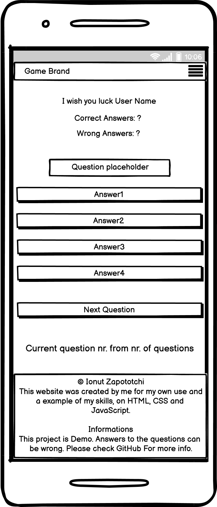

 4. Feedback screen

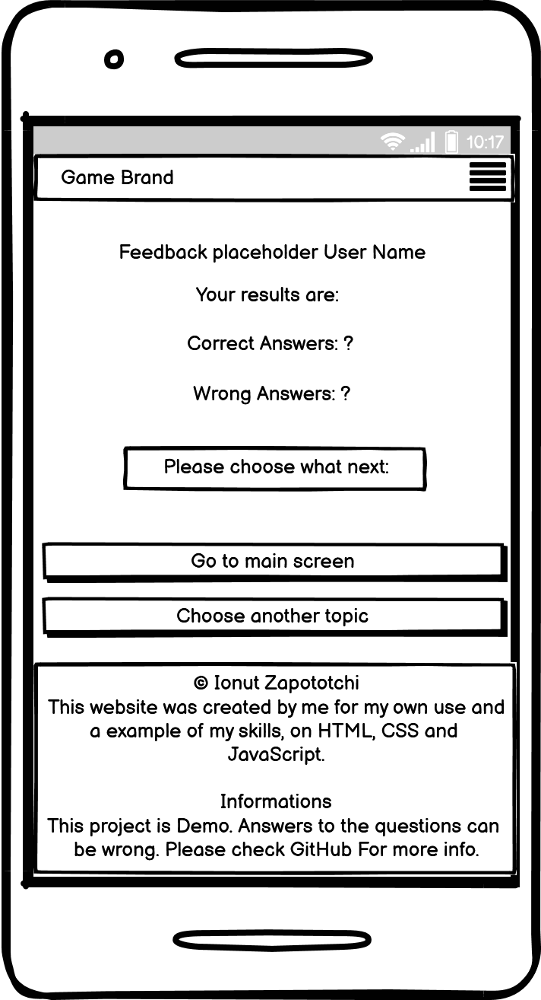

- Tablet Wireframes:

Only choose topic screen requires a specific design for tablet. Rest of screens are the same for mobile and tablet

 1. Choose Topic

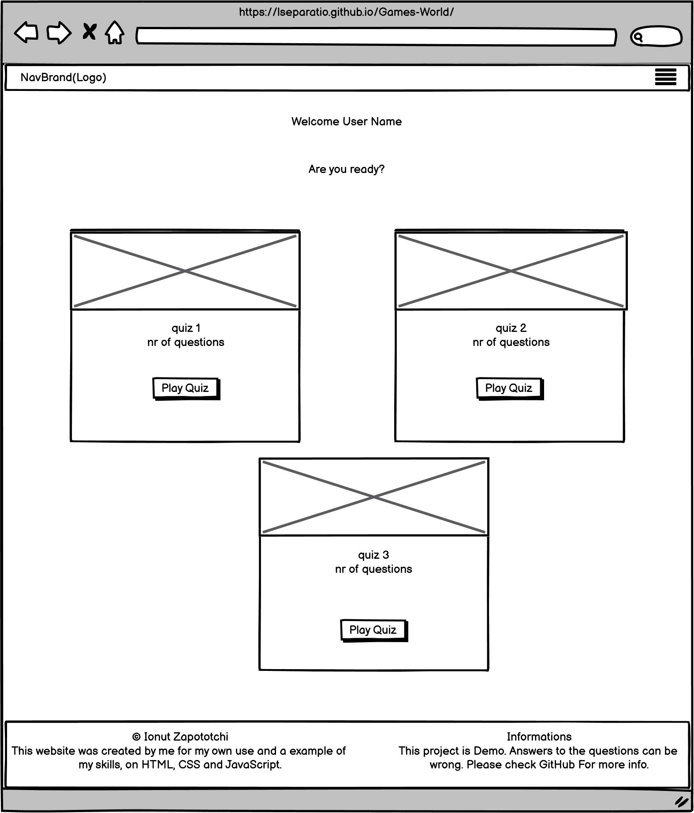

- Desktop Wireframes:

 1. Index Page

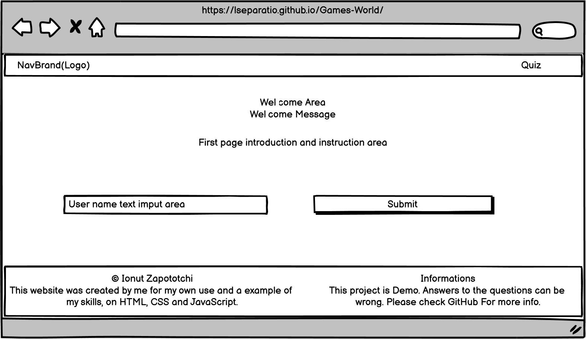

 2. Choose topic screen

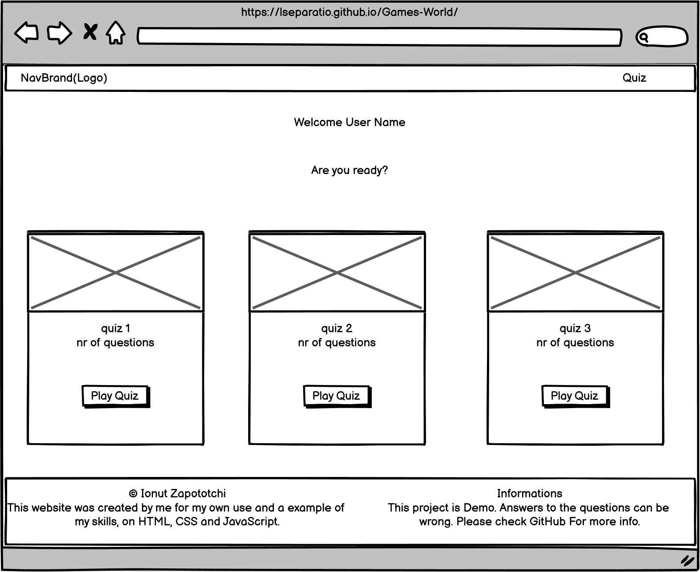

 3. Question screen

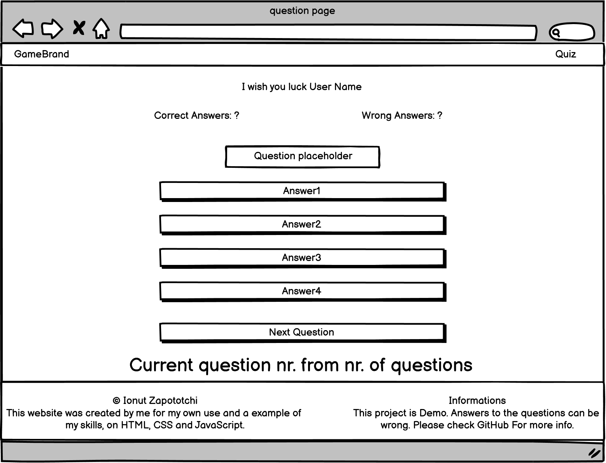

 4. Feedback screen

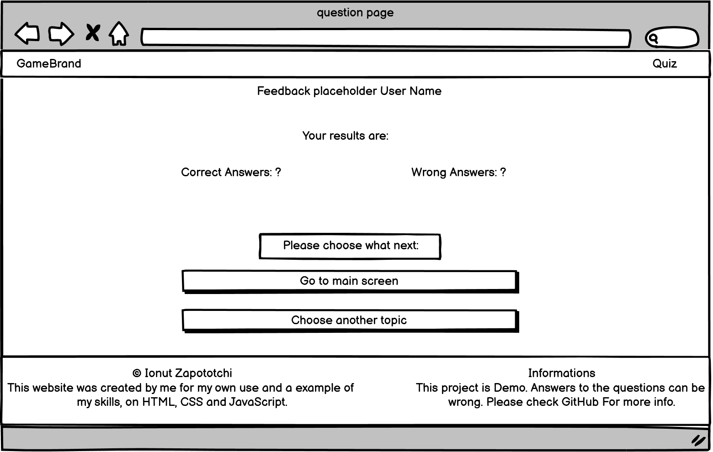

### Tools

- Visual Studio Code
- GIMP ( For image editing. Briliant open-source editor. )
- Microsoft Paint
- Bootstrap 5.1.3

### Colors

- For primary colors i used Blue Navy (183bff), and white for text.
- Red and green so mark correct answers and wrong answers.
All colors adjusted for optimal contrast ratio using: <https://webaim.org/resources/contrastchecker/>

### Images

- Images was taken from <https://www.freeimages.com/>

