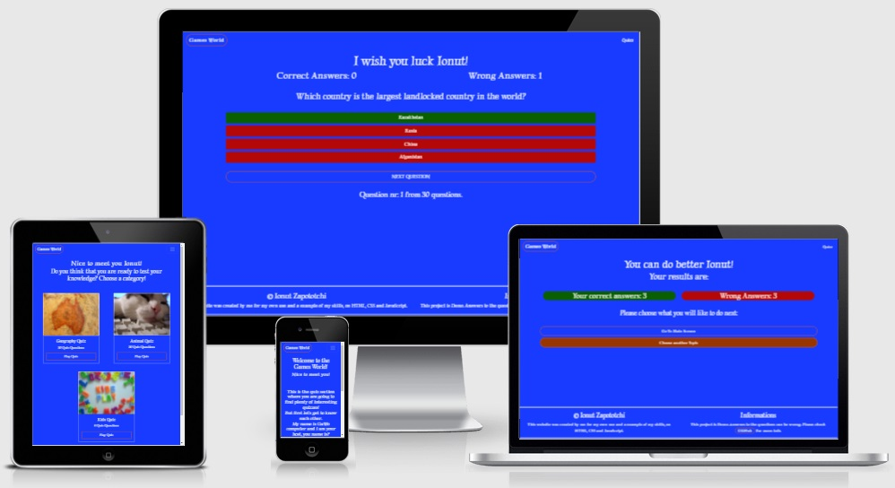
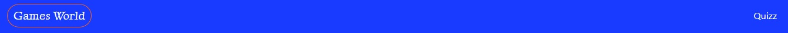
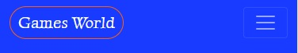
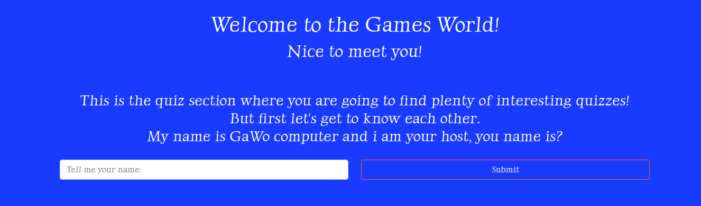
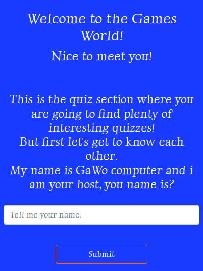
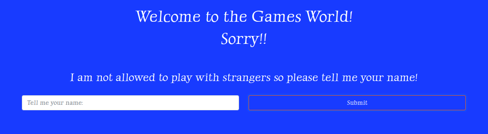
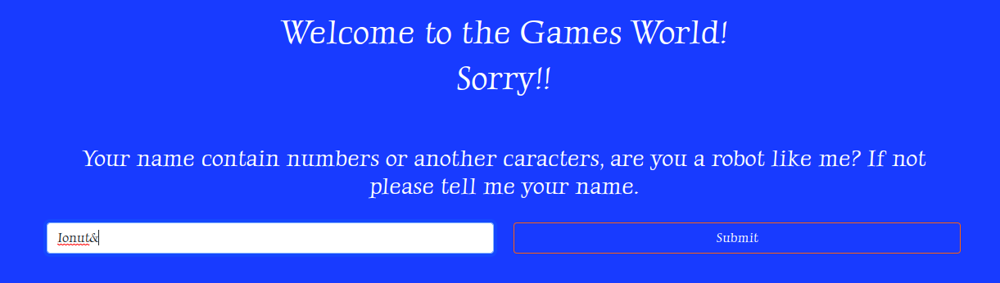
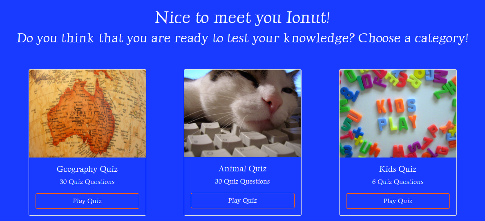
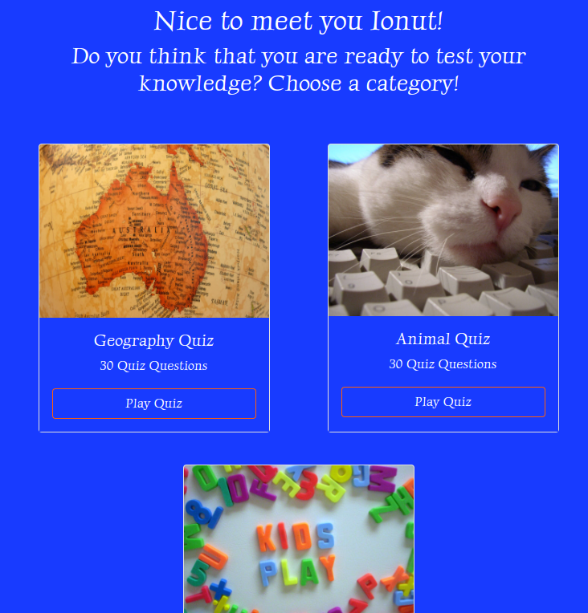
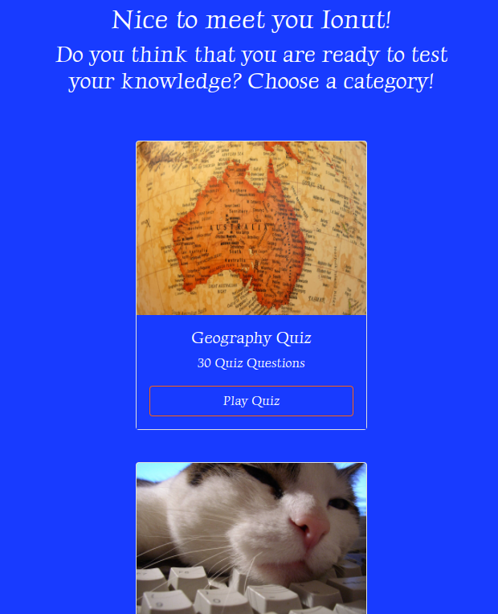

# Welcome to Games-World project

This project is an example of a quiz created in  HTML, CSS and JavaScript

See this project on live enviroment on GitHub Pages here: <https://lseparatio.github.io/Games-World/>

## Features

Click To Expand Features

### Navigation

- Same navigation menu is used across all pages for consistency.

- Navigation was designed to be easy to use and to understand.

- Navigation was designed to work well on all devices.
- Even if a nav-bar was not necessary for this project, I created one to make it easier to expand the project with other pages, games, etc ...

### First Screen
First Screen was designed to present the website for user in a friendly manner and to ask for user name.
- First Screen Desktop

- First Screen Mobile

### Name validation screens

- Empty name validation screen

- Special characters validation screen

### Choose topic screen

- Choose topic screen desktop

- Choose topic screen tablet

- Choose topic screen mobile

Images from: <https://www.freeimages.com/>

Color adjusted for better contrast ratio using: <https://webaim.org/resources/contrastchecker/>

